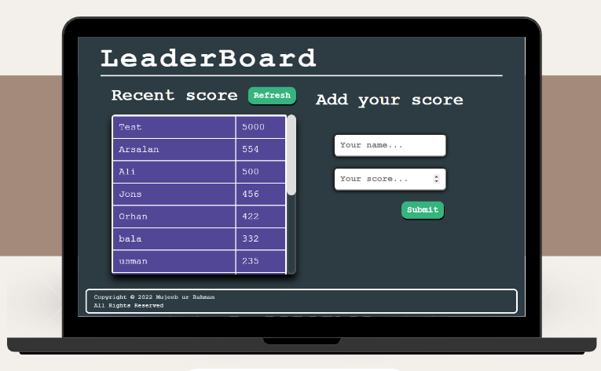
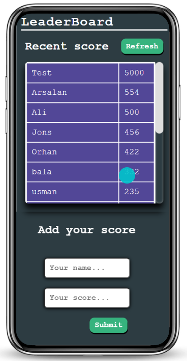

   

# Leaderboard
The leaderboard web app displays the top scoring player on the fictional game of life. It also allows any player to submit their score. All data is preserved thanks to the external leaderboard API service.

## Preview 

### Desktop Display

### Mobile Display

## Getting Started
To get a local copy up and running follow these simple steps.

### Prerequisites
- VIsual Studio Code.
- A Web Browser (preferably Google Chrome)

### Setup
- Clone the GitHub Repository
- run this commands in your terminal:
    - `npm install`
    - `npm run build`
    - `npm start`

### Usage
  After running `npm start` the website will be opened automatically on your default browser.

## Built With
- **HTML/CSS & JS best practices:** Correct use of tags, elements, properties and syntax.
- **Git flow:** Correct use of Branches for deployment and features development.
- **Linters Check:** Local and Pull Request check for errors, bugs and stylistic errors in code.
- **Webpack:** used as a bundle to compile JavaScript modules.

## 🌎 Live Demo:
- [Live Demo Link](https://mujeeb4582.github.io/Leaderboard/dist/)

## Author
### 👤 **Mujeeb ur Rahman**

- GitHub: [@Mujeeb4582](https://github.com/Mujeeb4582)
- Twitter: [@Mujeebu93992980](https://twitter.com/Mujeebu93992980)
- LinkedIn: [mujeeb-ur-rahman-54268011a](https://linkedin.com/in/mujeeb-ur-rahman-54268011a)

## 🤝 Contributing

Contributions, issues, and feature requests are welcome!

Feel free to check the [issues page](../../issues/).

## Show your support

Give a ⭐️ if you like this project!

## Acknowledgments

- Thanks to the Microverse team for the great curriculum.
- Thanks to the Code Reviewer(s) for the insightful feedback.
- A great thanks to My coding partner(s), morning session team, and standup team for their contributions.
- Hat tip to anyone whose code was used.

## 📝 License

This project is [MIT](https://github.com/Mujeeb4582/Leaderboard/blob/main/LICENSE) licensed.

_NOTE: we recommend using the [MIT license](https://choosealicense.com/licenses/mit/) - you can set it up quickly by [using templates available on GitHub](https://docs.github.com/en/communities/setting-up-your-project-for-healthy-contributions/adding-a-license-to-a-repository). You can also use [any other license](https://choosealicense.com/licenses/) if you wish._

